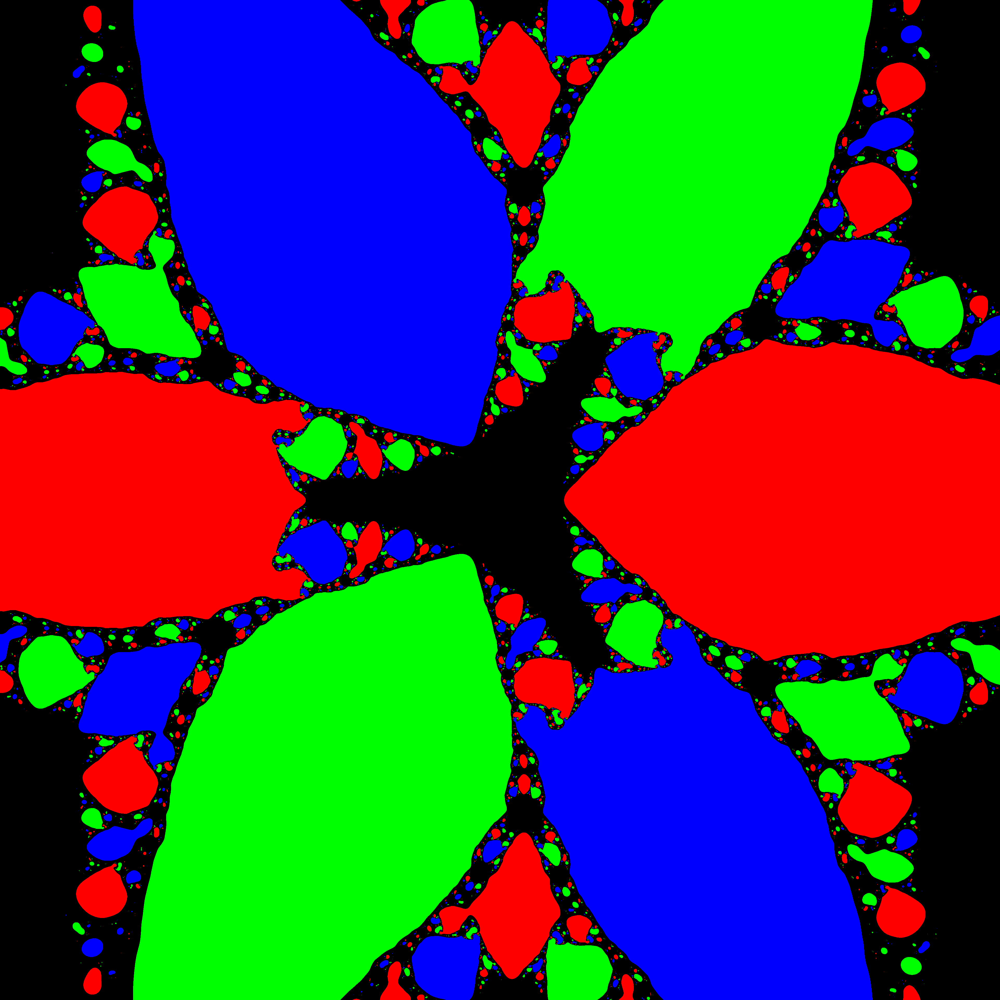
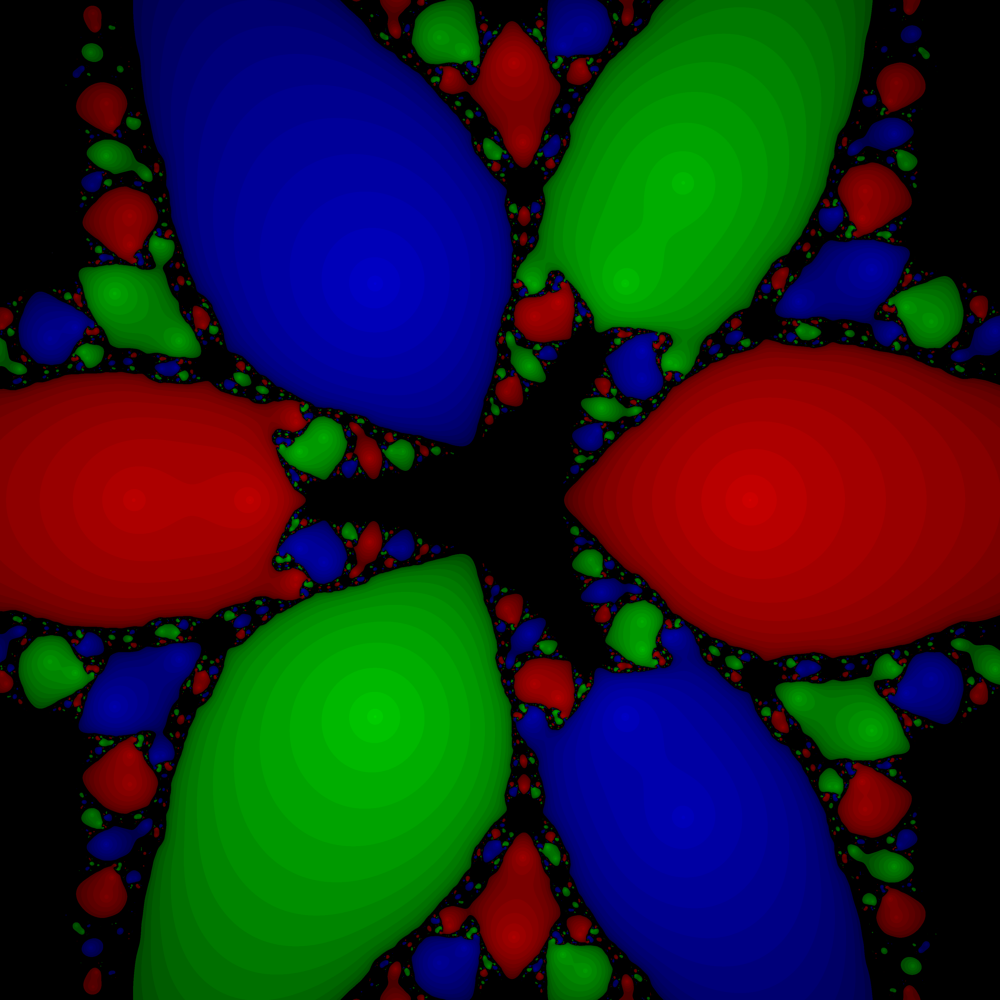

# Newton Fractal
This project generates [Newton fractal](https://en.wikipedia.org/wiki/Newton_fractal) images from 
polynomials, using the [Secant algorithm](https://en.wikipedia.org/wiki/Secant_method) to find roots.

The main interest of this project is to study the behavior of root convergence in the complex plane.
It involves coloring points on a grid according to what root of a complex polynomial it converges to 
using a secant algorithm. It may be intuitive to think that each point converges to the root that is 
closest in distance to it but it is not the case. As you can see it forms these beautiful patterns that 
are infinitely detailed.

## Visualization
The fractals below were generated from the polynomial $f(z) = z^3 - 1$ centered at $-2.0 + 2.0i$
with a width of $4$. The dark fractal uses the number of iterations to alter the brightness of the 
pixels; the brighter a pixel is the fewer iterations it took to arrive at a root.

#### Light fractal


#### Dark fractal


## Usage

Clone the repository:

```bash
git clone https://github.com/hhyde32/matvar.git
cd matvar
pip install -r requirements.txt
```

Run the following commands to compile and save the generated fractals to the images directory.
This may take around a minute depending on your system.

```bash
javac Main.java
java Main
```
You can edit the botto of the Main.java file to generate different fractals.
